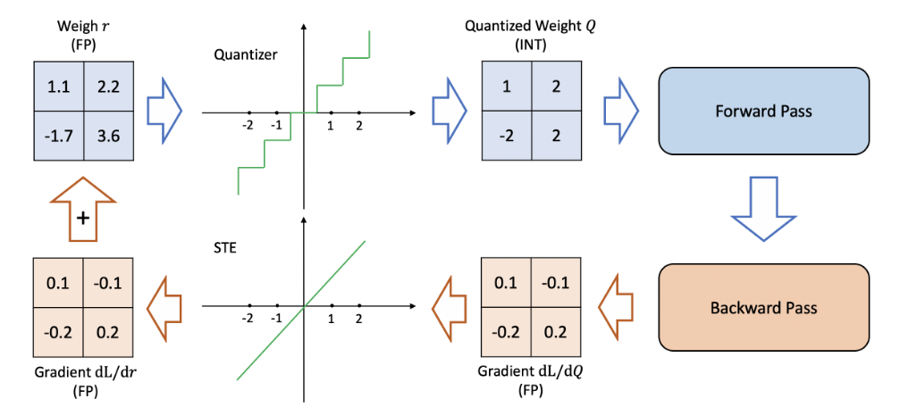

  
  

这篇文章是我在读了一篇模型量化的综述后动笔写就的，本人水平极其有限，写文章只是为了记录学习，如果有任何错误请及时指出并联系我修改！

## **背景**

自从 **ChatGPT** 发布以来，AI 浪潮席卷全球，而 AI 圈内则是各种大模型盛行。**Scaling Law** 的成立使得每一家企业都在训练越来越大的神经网络模型，但是这些大模型具有显著的缺点——**笨重**。即大模型需要大量的算力进行训练和推理，并且需要占据大量的存储空间，这意味着对于充斥着边缘设备的工业界来说，大模型的部署需要极大的成本。而边缘设备本身能够提供的资源是相当有限的，将无比巨大的模型直接部署到边缘设备上一是成本高，二是时效性差，无法满足工业界的需求。所以我们需要使用特殊的方法来提升模型的效率，能够在尽量不降低模型性能的情况下减少模型的参数，加快模型的训练和推理（主要是推理）。在这样的需求下，模型量化的方法自然成为一种主流。

量化在数字信号处理领域是指将信号的连续取值（或者大量可能的离散取值）近似为有限多个（或较少的）离散值的过程。神经网络模型的量化也是类似的，通过建立一个映射，将原来的需要更多比特表示的参数使用更少的比特表示。例如原来的神经网络的参数是用 32bit 表示的，我们可以建立映射，用 8bit 来表示每一个参数，这样就能够直接减少 4 倍的存储，推理的速度也更快了。

从上面的描述中我们也能看出，量化的最终目的可以概括为两个：

1. 尽可能保持模型原来的性能
2. 尽可能减少模型的“重量”，加快模型的训练或推理

## 一些基本的概念

根据量化方法的不同特点，我们可以对量化方法进行分类，另外模型量化中有一些专业术语需要知晓，下面就介绍一部分供参考。

### 均匀 / 非均匀量化

所谓**均匀量化（Uniform quantization）**就是指有**固定的量化精度**的方法，例如最常见的整数量化：

$$Q(r)=\text{Int}(r/S)-Z \tag{1} $$

在这个式子中，$$Q$$ 是量化器，$$r$$ 是浮点输入，$$S$$ 是缩放因子，$$Z$$ 是整数零点（虽然是零点，但不一定是 0 哦！此处的“零点”是指当输入为 0 时对应的量化值），而 Int 指的是四舍五入方法，将一个实数映射为整数。整数量化拥有固定的量化精度——1，所以它是一种均匀量化方法。

  
  <figcaption>图 1：均匀与非均匀量化示意图</figcaption>
  

而非均匀量化则是相反的，其没有一个固定的量化精度，即其量化值并不是均匀的。均匀量化和非均匀量化的对比示意图可以从图 1 中看出。

非均匀量化常被用来处理钟形分布和长尾分布的参数，常见的非均匀量化规则例如采用对数分布使量化步长成指数增加，或者使用二值向量的线性组合来表示原向量等。最近的工作把模型量化定义为一个优化问题：

$$ \min_Q |Q(r)-r|^2 \tag{2} $$

由于非均匀量化方法难以在通用的计算硬件（GPU 和 CPU）上高效部署，业内普遍采用的还是均匀量化方法。

- **反量化**

在这里我们引入反量化的概念，顾名思义，反量化就是**将量化值还原为原始值**的过程。由于量化会造成数据精度的损失，所以反量化并不能完全还原原始的数据。我们上面提到的整数量化，其反量化可以通过下面的公式实现：

$$\tilde r=S(Q(r)+Z) \tag{3} $$

### 对称 / 非对称量化

还记得我们在均匀量化中提到的那个公式（1）吗？

这个公式中的 $$S$$ 被称作缩放因子，其可以由下面的式子计算得到：

$$S=\frac{\beta-\alpha}{2^b-1} \tag{4}$$

公式中的 $$\beta$$ 和 $$\alpha$$ 确定了一个量**化的范围**，例如 $$\beta=32, \alpha=-32, b=4$$ 意味着我们把 [-32, 32] 范围内的值使用 4bit 表示，代入计算得到 $$S=4.27$$，这意味着原值每增加 4.27，量化后的值就要增加 1，所以从这个例子也能看出这里的 $$S$$ 所表示的含义就是：**当我们使用 b 个 bit 位对原值进行量化操作时，原值每增加 $$S$$， 量化后的值就需要增加 1**

根据量化范围（$$\alpha 和 \beta$$）的特点，我们可以把量化方法分为**对称量化**和**非对称量化**。

- 当 $$\alpha = \beta$$ 时，是对称量化
- 当 $$\alpha \ne \beta$$ 时，是非对称量化

可以从下面的图 2 中直观地看出两者的不同：

  
  <figcaption>图 2：对称与非对称量化对比图</figcaption>
  

相比而言，对称量化更加的直观简便，只需要确定一个对称的量化范围，然后让公式（1）中的 $$Z=0$$ 即可。常见的对称量化方法是直接**取最大/最小值的绝对值中较大**的作为量化范围的一半或者根据数据分布手动确定范围，然后使用 clip 方法裁剪溢出的值（例如当量化范围为 [-3, 3] 时，值 3.5 直接被放缩到 3）。当然，这种方法过于简单，容易受到异常值的影响导致量化精度的下降，所以我们也可以采用**分位数**来代替最值，或者使用更加高级的方法（比如最小化原始数据分布和量化数据分布的**KL散度**等）

而非对称量化则具有**更加紧密的裁剪范围**，因为其可以根据实际的数据分布设计裁剪范围，从而实现更好的量化效果。尤其是在非线性层为 **ReLU** 函数的情况下，如果我们采用对称量化，会导致有一半的量化范围被浪费了，而采用非对称量化能够使精度提升整整一倍！

一般对称量化常用于量化**模型的权重**，由于 $$Z=0$$， 所以在进行矩阵乘法运算时可以**直接忽略大量的交叉项运算**。
而非对称量化则常用于量化**激活值**，因为输入的数据分布通常不是对称的，比如图片输入是 0-255 的像素值，如果使用对称量化会导致模型性能大幅降低。而**非对称量化所带来的交叉项的计算则可以被吸收到 bias 中**（这里挖个坑，后面有时间填），所以其相比于对称量化基本不会增加太多推理时间。

### 动态 / 静态量化

选择量化范围（$$\alpha, \beta$$）的过程称之为**校准**，目前我们已经讨论了很多校准的方法，但它们都不会在模型推理的过程中发生改变，然而对于不同的输入其激活图是不同的，我们还可以把量化这件事做得更加精细。所以就有了静态/动态量化的方法。

- **动态量化**：对每一个输入都计算其**专属的量化范围**，这意味着我们需要在运行过程中实时计算数据的特征（最值、均值等），然后利用其特征确定量化范围。虽然这一过程会带来计算量的增加，但其能够有效提升模型的精度。
- **静态量化**：所谓静态量化就是针对所有的输入都使用**同一个量化范围**，这意味着在推理时量化范围是确定的，我们需要使用初始数据的特征计算量化范围，然后在整个推理过程中应用。目前有许多方法可以找到最优的量化范围，比如最小化模型权重量化前后的 MSE 或 CE；另外还有很多方法是将量化的范围作为参数，在训练阶段和 NN 权重一起学习的，这一类量化器我们称之为可学习量化器。

> 目前相关行业从业者普遍采用的是静态量化方法。

### 量化粒度

量化粒度这一概念是针对**卷积神经网络**提出的，实际上其和校准类似，根据模型的权重来计算量化范围的。由于一个 CNN 模型中通常含有许多卷积层，每一层卷积层又有多个滤波器，根据不同的精度需求，我们可以有多种确定量化范围的方式。我们可以列出以下几种量化粒度：
1. **分层量化**：**每一个卷积层**使用相同的量化范围，不同的卷积层之间采用不同的量化范围。
2. **分组量化**：每一个卷积层的**多个滤波器（卷积核）进行分组**，每一组具有相同的量化范围。
3. **通道量化**：每一个卷积层的**每一个滤波器**之间都采用不同的量化范围。
4. **子通道量化**：**同一个滤波器内部**采用不同的量化范围（例如按行/列量化）。

不同量化粒度之间的差异可以从图 3 中看出：

  
  <figcaption>图 3：分层量化与通道量化对比图</figcaption>
  

图 3 中，可以看到 Layer 1 具有多个滤波器，分层量化对所有的滤波器都采用相同的量化范围，而通道量化是根据每一个滤波器的参数来确定量化范围的。

从前面的讨论中，不难看出不同的量化粒度，其计算成本和量化效果的差异是不同的。**越是细粒度（子通道量化）的方法，其量化效果越好，但是计算的成本也越高**。考虑到准确率和计算效率的平衡，业内普遍采用通道量化方法来量化卷积核。

### 微调方法

接下来进入到一个相对而言比较复杂的环节（其实也没有多复杂 啊哈哈），我们需要确定**量化和微调（训练）的关系**，我们既可以在模型量化之后进行微调，也可以先对模型微调之后再量化。前者称之为**量化感知训练（Quantization-Aware-Training——QAT）**，后者称之为**后训练量化（Post-Training-Quantization——PTQ）**。两者的区别可以从图 4 中看出：

  
  <figcaption>图 4：QAT 和 PTQ 对比图</figcaption>
  

> 图 4 中的 calibration data 是原始数据的一部分，其专门用于校准

- **QAT**

在对模型进行量化之后，模型的精度会下降，此时需要对模型进行训练以提高量化模型的性能，这个过程就是 QAT。值得注意的是在进行训练的过程中，尽管模型的参数是量化后的（例如可能全是整数），但进行**训练时我们需要以浮点精度计算**，否则误差累计过多可能导致准确率过低，造成**梯度消失或梯度爆炸**。

细心的读者可能会注意到，前面在量化时我们采用的是**不可微**的映射（其梯度几乎处处为0），是不能直接进行反向传播的。使用直通估计器（Straight-Through-Estimator——STE）可以解决这一问题。具体来说，直通估计器就是一个恒等映射，其让$$\frac{dQ}{dr}=1$$，使得梯度能够传递下去，进而更新模型参数 $$r$$。QAT 的流程图如下图 5 所示：

  
  <figcaption>图 5：QAT 流程图（含STE）</figcaption>
  

尽管 STE 是一个较为粗略的估计，但其表现却异常的好，除了在一些较为极端的量化模型上（比如二值量化）。当然，除了 STE 之外，还有不少方法也试图解决这一问题，但这里我们不再赘述（感兴趣的可以自行搜索），你目前只需要知道 STE 目前最常用的方法。

QAT 的缺点在于其需要花费资源对量化模型进行训练，在一些场景下这会增加不必要的成本，而 PTQ 则解决了这一问题。

- **PTQ**

与需要大量数据进行训练的 QAT 不同，PTQ 可以应用于**数据有限或缺乏标注**的场景，其不需要再对量化模型进行训练，而是直接对训练后的模型进行量化操作得到量化模型。PTQ 虽然节省了很多算力，但是在低精度场景下，模型的准确率会降低。因此，有许多方法试图缓解 PTQ 对模型性能的影响（同上，感兴趣可自行搜索，后续可能会分享相关内容，先在此处挖个坑）。

- **零样本量化（Zero-shot）**

通过上面的内容，我们了解到 QAT 需要对量化模型进一步训练以提升其准确率，但在很多情况下，**利用原始训练数据进行再训练是难以实现的**（例如原始数据过大或涉及隐私），此时就需要**零样本量化**出马了。

我们可以把需求划分为两个等级：
- Level 1：无数据且无需微调
- Level 2：无数据但需要微调

ZSQ 中一个比较流行的方法是**生成和原始数据分布类似的合成数据**，然后利用合成数据校准或微调量化模型。一项早期的工作利用生成对抗网络（GAN）解决这一问题，其将预训练的模型作为判别器，训练一个生成器使得其生成的图片能够很好地被判别器分类，然后利用这个生成器生成的图片进行知识蒸馏。然而，这一方法并不能捕捉到真实数据在中间层的分布，没有考虑中间层分布的合成数据并不能准确表示真实数据的分布。为了解决这一问题，一些研究使用 BN（batch normalization）层的数据来生成更真实的合成数据。还有别的方法，这里就不再赘述。

### 随机量化（Stochastic Quantization）

常规的量化过程是确定的，QAT 过程中更新的权重参数，在经过量化后可能并没有改变量化模型的参数（比如 1.1 和 1.05 都被量化为 1），为了能够**增强量化的随机性**，增强模型的探索能力使得其能够“跳出”局部最优，我们可以将注意力聚焦到**随机量化**这一方法上。

随机量化方法使用原始值到量化值之间的距离计算概率，比如取整操作可以定义如下：

$$
\text{Int}(x)=
\begin{cases}
\lfloor x \rfloor & \text{with probability } \lceil x \rceil -x, \\
\lceil x \rceil  & \text{with probability } x - \lfloor x \rfloor. \\
\end{cases}
\tag{5}
$$

然而这样的策略并不能扩展到二值量化，对于二值量化，我们有下面的公式：

$$
\text{Binary}(x)=
\begin{cases}
-1 & \text{with probability } 1-\sigma(x), \\
+1  & \text{with probability } \sigma(x). \\
\end{cases}
\tag{5}
$$

其中 $$\sigma(\cdot)$$ 是 sigmoid 函数。

随机量化操作有点类似于 **epsilon-greedy 方法**，其缺点在于随机操作会增加计算成本，目前并没有被广泛地使用。除了上面的策略之外，还有其他的方法，例如每一次只量化神经网络中随机一部分参数等，这里不多加赘述。

## 进阶概念

下面我们将介绍模型量化中的一些进阶的概念，包括**模拟量化（simulated quantization）**，**混合精度量化（mixed-precision quantization）**，**硬件感知量化（hardware-aware quantization）**，**蒸馏辅助量化**，**极端量化**，**向量量化**的不同方法。

### 模拟量化 / 纯整数量化

有两种方法来部署量化后的神经网络模型，分别是**模拟量化（又名假量化）**和**纯整数量化（又名定点量化）**。其区别如图 6 所示。在模拟量化中，模型的参数是以**低精度存储**的，但是**运算是以高精度（浮点）进行的**，因此在进行浮点运算之前，需要对模型参数进行**反量化**处理。

  
  <figcaption>图 6：模拟量化和纯整数量化推理流程图</figcaption>
  

这样的方式虽然能够一定程度上提高模型正确率，但这也将导致我们并不能够从低精度逻辑运算中获益。低精度逻辑运算相比全精度来说，在**延迟、功耗和面积效率**上具有明显的优势。如图 7 所示。

  
  <figcaption>图 7：左图是两张卡在不同精度上的峰值吞吐量，右图是 45nm 技术不同精度下能源成本和相对面积成本的比较</figcaption>
  

此外，不少的硬件（如 NVIDIA V100 和 Titan RTX）都做了量化适配，它们提高了低精度运算速度，优化了模型推理的吞吐量和延迟。执行 INT8 的加法比 FP32 在能耗上低了 30 倍，面积效率提高了 116 倍！可如果我们使用模拟量化方法的话，就没法从中获益。

对纯整数量化的相关工作感兴趣的可以查看下面的几篇文章：

> Darryl Lin, Sachin Talathi, and Sreekanth Annapureddy. Fixed point quantization of deep convolutional networks. In International conference on machine learning, pages 2849–2858. PMLR, 2016.
> Benoit Jacob, Skirmantas Kligys, Bo Chen, Menglong Zhu, Matthew Tang, Andrew Howard, Hartwig Adam, and Dmitry Kalenichenko. Quantization and training of neural networks for efficient integer-arithmetic-only inference. In Proceedings of the IEEE Conference on Computer Vision and Pattern Recognition (CVPR), 2018.
> Sehoon Kim, Amir Gholami, Zhewei Yao, Michael W Mahoney, and Kurt Keutzer. I-bert: Integer-only bert quantization. arXiv preprint arXiv:2101.01321, 2021.
> Ashish Vaswani, Noam Shazeer, Niki Parmar, Jakob Uszkoreit, Llion Jones, Aidan N Gomez, Łukasz Kaiser, and Illia Polosukhin. Attention is all you need. In Advances in neural information processing systems, pages 5998–6008, 2017.

值得一提的是在纯整数量化中有一种特殊的量化方法——**二元量化**，其采用**二元数**作为缩放因子。所谓的二元数是**分子为整数，分母为 2 的指数的有理数**，如 $$\frac{s}{2^k}$$，在这样的设计下，我们只需要考虑整数加法，乘法和移位运算即可，**不需要使用相对复杂的除法运算**。由于移位运算对硬件友好，所以这样的方法可以对推理进行加速。另外这种方法强制要求所有的加法必须具有相同的二元比例（缩放因子），例如残差连接等。

由于模拟量化的计算成本高，纯整数量化与二元量化是业内比较常用的方法。但对于一些计算资源丰富，存储资源稀缺的环境，使用模拟量化不失为一个好的选择。

### 混合精度量化

降低量化精度时可以见到，硬件的使用效率得到了大幅提升，但是低精度的量化会造成准确率的大幅降低，**混合精度量化**旨在两者之间寻求平衡。混合精度量化**对于每一层神经网络使用不同的量化精度**，如何确定一个最优方案呢？我们需要在一个**成指数增加的空间**中进行搜索，目前已经有许多成熟的方法解决这一搜索问题。

有研究使用基于**强化学习方法**来自动决定量化策略，并且使用了**硬件模拟器**，在强化学习智能体的反馈中加入了来着硬件加速器的反馈；有研究将量化精度搜索问题定义为网络架构搜索问题，并且使用 DNAS 方法来高效探索搜索空间。上面的这两种方法都是基于探索的，它们的一大缺点就是需要大量算力，并且对超参数和初始化敏感。

另一种方法使用**周期函数正则化**来训练一个混合精度的模型，能够自动识别不同层的重要程度，并且自动找到适合的比特数。另外还有诸如 HAWQ 的方法，详情可以看原始论文。

总的来说，混合精度量化就是根据**神经网络层的重要程度**，采用不同的量化精度，比如**相对不那么重要的层可以使用更少的比特表示，而较为重要的层则使用更多的比特表示**。

### 硬件感知量化

模型量化的效果还取决于硬件，所以为了实现更好的良好效果，我们需要确定硬件对不同级别的量化的适配水平，这和**片上存储器，带宽以及缓存层次结构**等都有关系。前面提到的强化学习的方法使用了模拟硬件，而还有的研究则是直接在硬件层面上部署量化操作，测量不同层的延迟以便确定量化精度。

### 蒸馏辅助量化

模型蒸馏的原理是使用大模型训练小模型，相比较于直接使用原始标签数据训练，大模型输出的 **logits**（最后一层的输出） 中包含更多的信息，并且**中间层的输出**也是有意义的，利用这些信息来蒸馏小模型会比直接训练效果更好。模型蒸馏的损失函数大致可定义如下：

$$\mathcal{L}=\alpha \mathcal{H}(y,\sigma(z_s))+\beta\mathcal{H}(\sigma(z_t,T),\sigma(z_s,T)) \tag{6}$$

其中，$$\alpha, \beta$$ 是权重系数，$$\mathcal{H}$$ 是交叉熵损失函数，$$z_s,z_t$$ 是学生和老师模型输出的 logits，$$\sigma$$ 是 softmax 函数，$$T$$ 是温度，其作用是改变模型输出的 logits 经过 softmax 后的分布。

> * 在普通的softmax函数中，公式是：
> 
>   $$
>   p_i = \frac{\exp(z_i)}{\sum_j \exp(z_j)}
>   $$
> 
>   其中 $$z_i$$ 是 logits。
> 
> * 在蒸馏中，我们引入了一个温度 $$T$$，改写为：
> 
>   $$
>   p_i^{(T)} = \frac{\exp(z_i / T)}{\sum_j \exp(z_j / T)}
>   $$
> 
> 它的作用：
> 
> * **T=1时**：就是标准的softmax，没有变化。
> * **T>1时**：softmax分布会“变平”，低概率的类别也会得到更高的概率值，使模型输出的概率分布更“软”。
> * **T<1时**：分布会变得“更尖锐”，高概率类别会变得更显著。

模型蒸馏还有很多其他的方法，例如使用多个教师模型训练一个学生模型，或者进行自蒸馏（self-distillation），这里不多加赘述。

### 极端量化

**二值量化**是将神经网络的参数用一个 bit 位表示，例如使用符号函数将所有的参数变成 1 或 -1，该操作不仅使得模型占用的存储空间小了 32 倍，也会带来计算速度上的提升（因为位运算更快）。BinaryConnect 的工作就是保留所有模型的参数，但在计算的过程中，使用符号函数将所有的权重映射为 1 和 -1，利用 STE 来更新网络的参数。BNN 则在此基础上，对激活值也做了二值量化。BWN 则额外引入了一个缩放系数 $$\alpha$$，以最小化原值和量化值之间的距离。

除了二值化，还有不少研究探索了**三值化**的可能性，考虑到神经网络中有不少权重接近 0，三值化允许量化后的参数为 0，可以提高量化模型的准确率。也有研究探索了**二值化和三值化的结合**，其可以在计算效率和准确率之间取得较好的权衡。

尽管二值化和三值化可以大大提高模型推理的速度，但过低的精度对准确率带来的损失也是比较严重的，许多研究正在试图缓解这一问题，我们大致上可以将其分为三类：

1. **最小化量化误差：**所谓量化误差就是量化值和原始值的距离，HORQ 和 ABC-Net 使用多个二值矩阵的线性组合的形式来表示原始网络的权重，另外有研究表明在更大更宽的神经网络上做二值量化可以很好地权衡准确率和模型尺寸。（就是用空间换准确率罢了）
2. **改进损失函数：**就是使用不同的损失函数来提升模型的训练效果，例如前面提到的公式（6）就是把损失设计为蒸馏损失和分类损失两个部分。同样地最终的损失可以考虑量化误差和分类损失两个方面。
3. **改进训练方法：**不少研究者对 STE 进行了改进，BNN+ 使用连续函数来估计符号函数的导数，其他的研究使用光滑可微的函数以近似并代替符号函数，除了加速推理，DoReFa-Net 对训练过程也进行了加速。

极端量化在 CNN 网络上已经有很多成果了，但在 NLP 领域面对一些具有极大参数量的网络上的效果还是未来可期的（现在应该有很多了啊哈哈）。

### 向量量化

实际上在上个世纪量化的思想就已经出现了，尤其是在 DSP（Digital-Sign-Processing）领域，量化方法经常用来压缩信号。其和机器学习中的量化的不同点在于，DSP 中的量化的目标是**让量化值和原值尽可能的接近**，而机器学习中的量化的最终目标则是使用**尽可能少的参数取得较高的准确率**。有时即使量化值和原值的差异很大，但只要模型准确率达标，我们仍然认为这是一个好的量化。

尽管如此，DSP 中的一些量化方法可以借用到这里的神经网络量化中，例如**向量量化**。具体的方法是将所有的权重进行**聚类**(例如 k-means)，然后**最小化权重到相应类别的中心点的距离**，公式如下：

$$\min_{c_1,...,c_k}\sum_i|w_i-c_j|^2$$

式中的 $$c_i$$ 表示第 i 个类别的中心点，$$w_i$$ 表示权重，每个 $$w_i$$ 都与一个 $$c_j$$ 相对应，通过查表的方式寻找对应关系。

除此之外，还有乘积量化（Product Quantization）的方法，感兴趣的可以自行查阅。

## 量化与硬件处理器

这地方先挖个坑，本人对于硬件的了解比较少，后续有时间单独写一篇文章讲一讲吧（会讲的

## 未来的挑战与方向

这篇文章是 2022 年的综述，这里提到的挑战与方向在 2025 年的今天看来或许过时了，不过还是简单地写一写吧。

- **量化软件**

目前的软件做的比较好的最多支持 INT8 的量化（比例 Nvidia's TensorRT, TVM 等），更低精度的软件需要被开发。

- **硬件与 NN 架构协同设计**

由于量化效果与量化值与原始值之间的差异并不一定对等，我们可以有更多的自由度来调整网络以达到好的量化效果，已经有研究探索了网络的深度和宽度对量化效果的影响，未来我们可以把目光聚焦于硬件架构上，实现硬件架构和模型协同设计。（这对于在 FPGA 上的部署很有用）

- **耦合压缩方法**

将多种神经网络压缩方法结合，例如量化、剪枝、蒸馏等，如何结合这些方法以取得更好的量化效果是值得探索的。

- **量化训练**

目前已经能够实现半精度的 NN 训练，但更进一步的 INT8 等级就不行了，尽管已经有研究这一方向的工作，但这些方法通常涉及很多超参数调整，并且只在少数模型和简单的任务上有效。问题在于使用 INT8 精度，训练将会变得不稳定且发散。解决这一挑战将对许多应用产生影响，尤其是在边缘设备上进行训练。

## 总结

**只要我们仍然在电脑上进行抽象的数学计算，探索如何让计算更加高效的研究就永远存在**。量化 NN 的价值和意义我们已然探讨了许多。量化 NN 是可行的，这是由 NN 的几个特点所决定的。
1. NN 是**计算密集型**的结构，参数的有效表示很重要。
2. NN 是**过度参数化**的，其中的许多参数都是冗余的。
3. NN 的**分层结构**提供了一个额外的探索维度，这激发了例如混合精度量化的方法。

在这篇文章中，我们首先介绍了一些基本的概念，例如均匀 / 非均匀量化，对称 / 非对称量化，静态 / 动态量化。然后针对卷积神经网络的特点，我们讨论了分层量化、分组量化、通道量化、子通道量化。接着我们就训练与量化的关系展开讨论，介绍了量化感知训练（QAT）和后训练量化（PTQ），而由于训练数据难以获取的问题，我们又介绍了零样本量化（ZSQ）。为了能够增加量化过程的随机性，我们介绍了随机量化的方法。

后半文我们讨论了一些量化中的进阶概念，例如模拟量化，纯整数量化，混合精度量化，硬件感知量化，蒸馏辅助量化，极端量化，向量量化等，对这些概念还不熟悉的可以返回到上面浏览相关内容。

> 行文至此，也到了尾声，本人是初学者，文中有所疏漏之处还望大家指出，愿与大家共同进步！

参考文献：

[Gholami A, Kim S, Dong Z, et al. A survey of quantization methods for efficient neural network inference[M]//Low-power computer vision. Chapman and Hall/CRC, 2022: 291-326.](https://arxiv.org/abs/2103.13630)